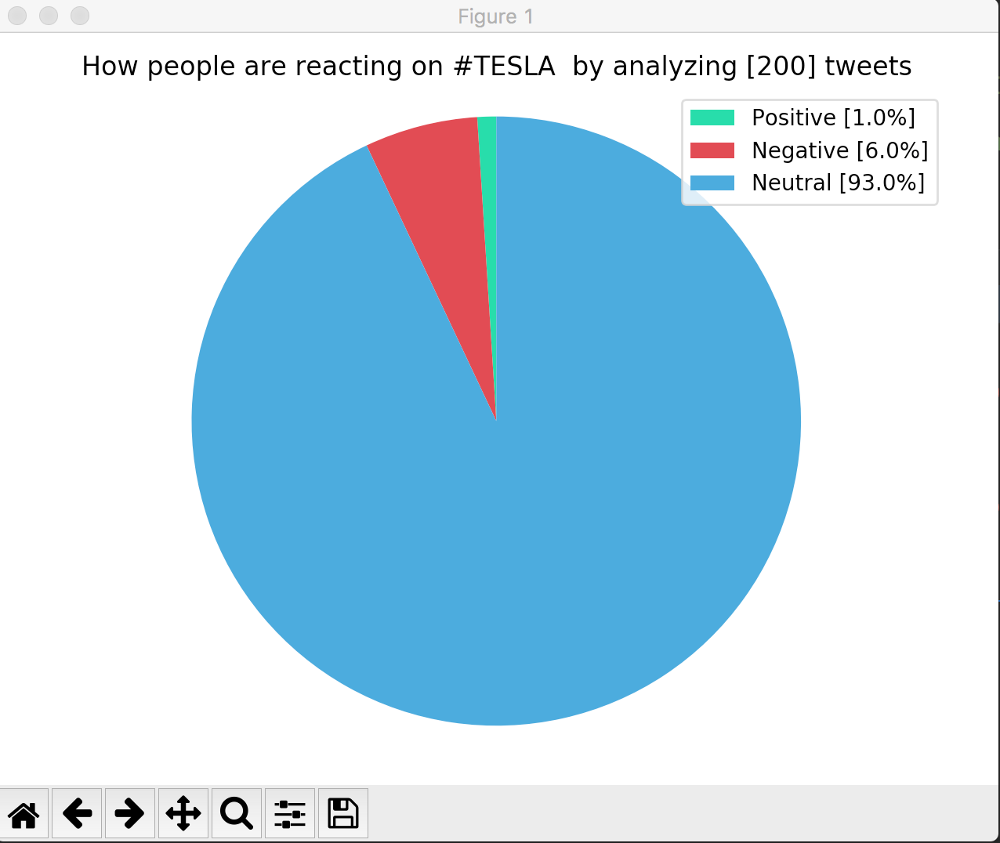
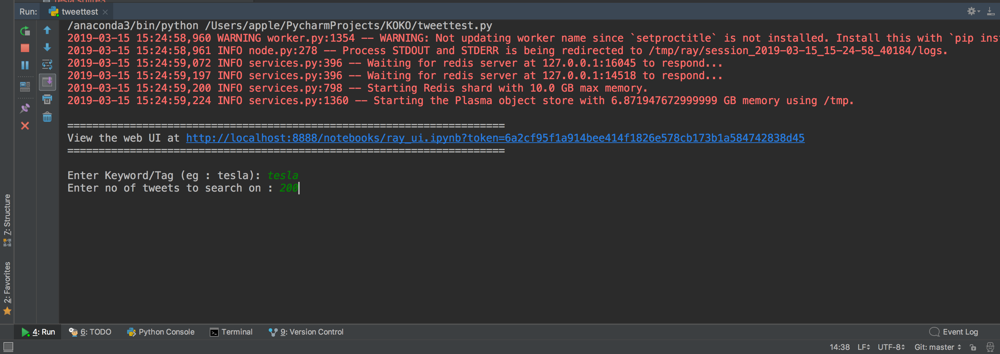
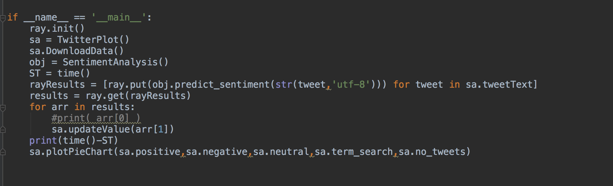
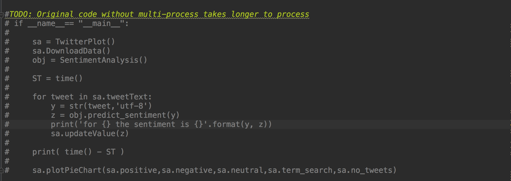

# Sentiment-analyser

[](https://gitter.im/Sentiment-Analysis-Plotter/community?utm_source=badge&utm_medium=badge&utm_campaign=pr-badge)  [](https://www.python.org/)  
# Sentiment Analysis Plotter

Sentiment Analysis Plotter plots the overall sentiment of a given hastag eg:#tesla, #india etc etc.


## Twitter plot



## Program Inputs



## Multiprocessing using ray



## Original Code (Sequential)



## Getting Started

Clone this repository in your system, run the sentiment_analyser.py first to get the idea of how the program 
works, in the later stages run the tweetest.py, in tweetest.py provide the API keys

### Prerequisites

```
Python3.3 & >
Pandas
Sklearn
nltk
ray 
matplotlib
tweepy
```

## Built With

* [tweepy](http://www.tweepy.org) - Python framework for accessing twitter API
 


